# 2048
A fast cross-platform C++ terminal implementation of the classic game [2048](https://en.m.wikipedia.org/wiki/2048_(video_game)).

# Features
- Saving and loading game states with custom settings
- Lots of settings for customization
- Custom colored cells
- Drawing tables with ASCII table symbols
- Really fast on all systems

# Settings
- **Board Size**: The size of the board (default: 4)
- **Color Support**: Whether to use colors or not (default: true)
- **Output Title**: Whether to output the title or not (default: true)
- **4 Difficulty Levels**: Potato, Easy, Medium and Hard (default: Medium)

# Compatibility
Works great with both Windows (not sure about windows 8 or older) and UNIX systems.
Linux has the best compatibility though (most of the code was written in termux).

# Building

## Requirements
- git or gh
- cmake (3.0 or newer)

## First time
```bash
git clone https://www.github.com/ItsCrist1/2048.git
cd 2048
./setup.sh
```

## Afterwards
```bash
./exec.sh
```
# Screenshots

## Android
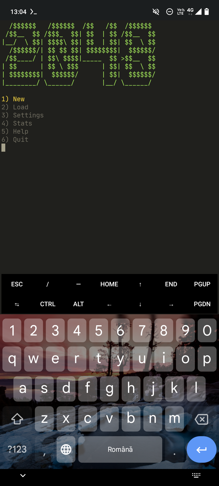
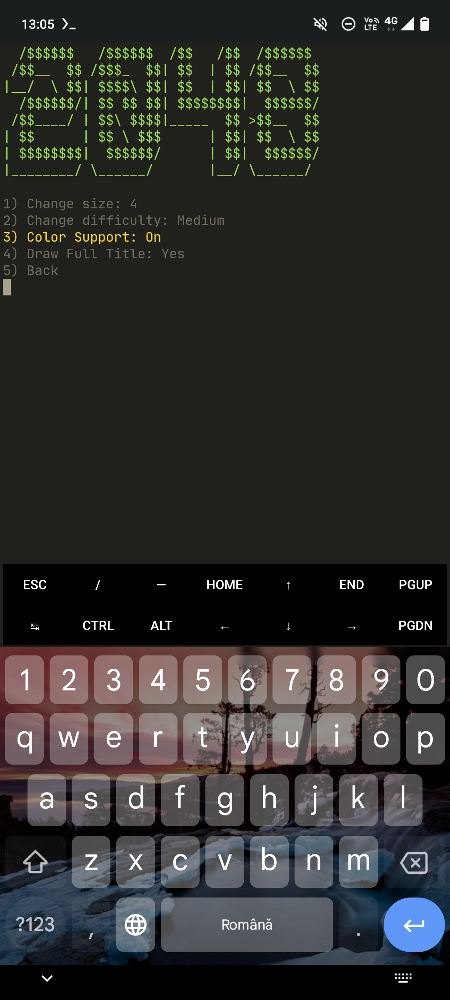
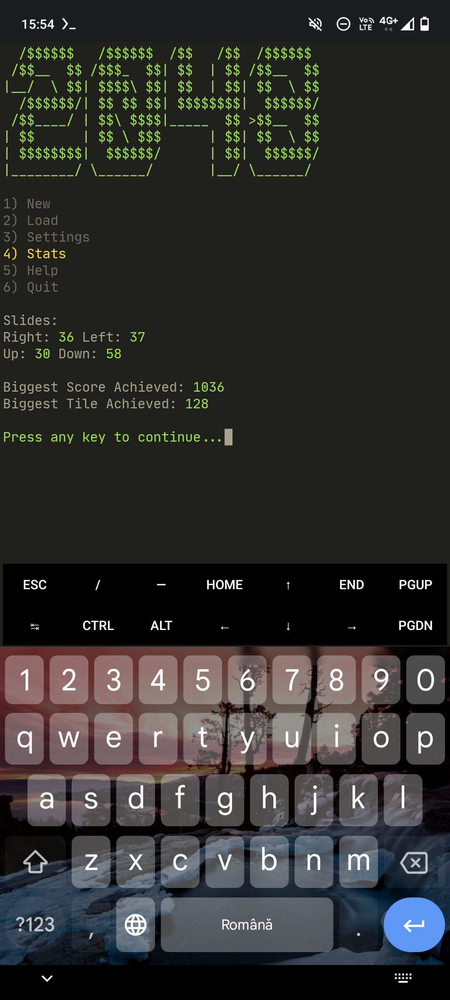
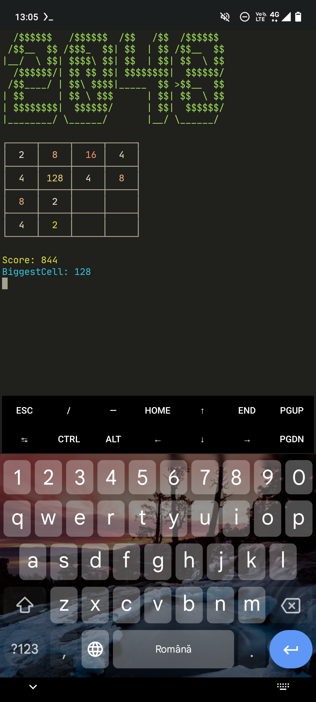
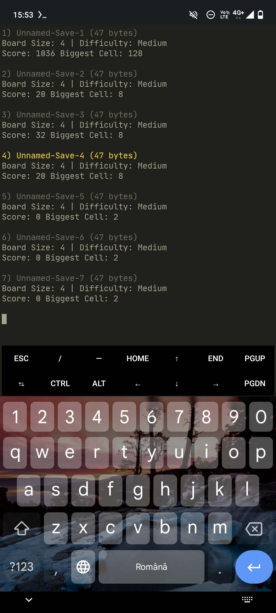

## Arch Linux
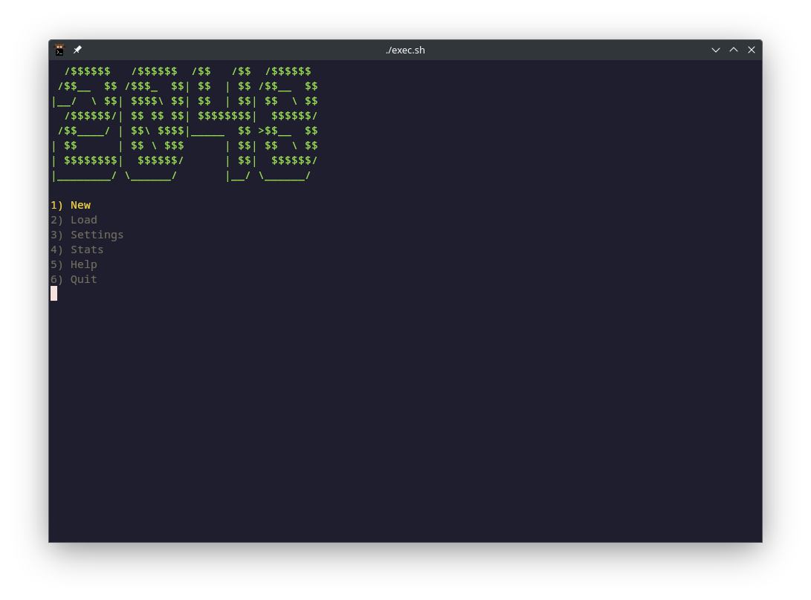
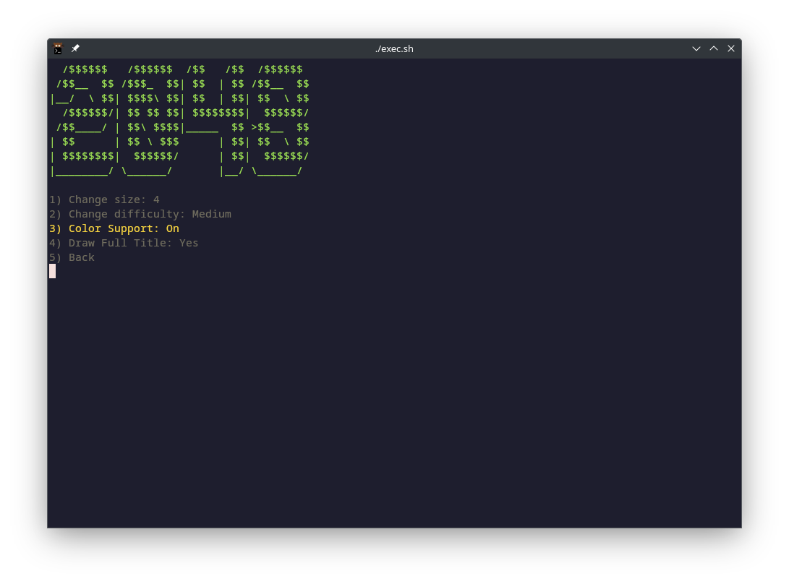
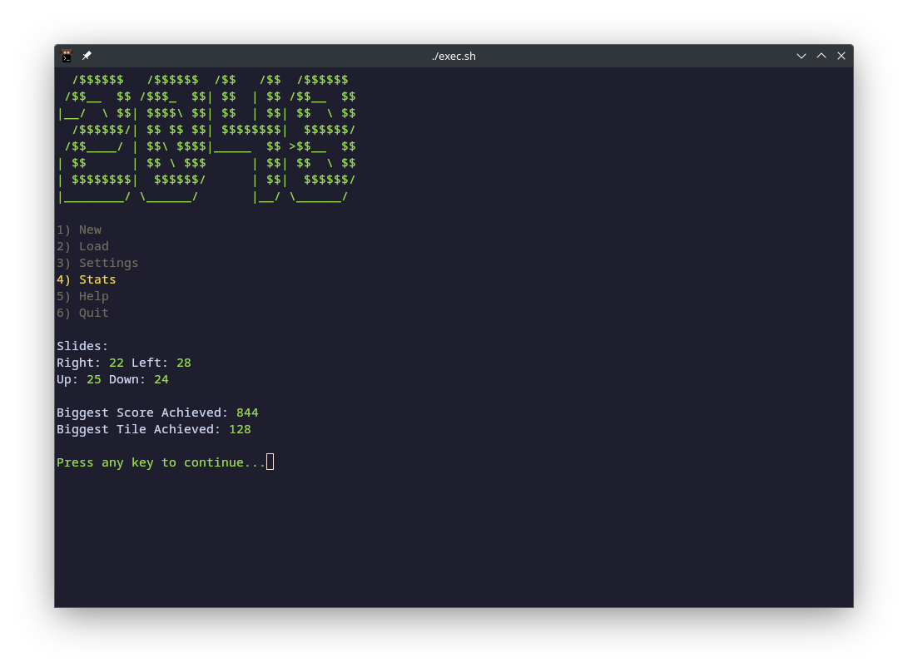
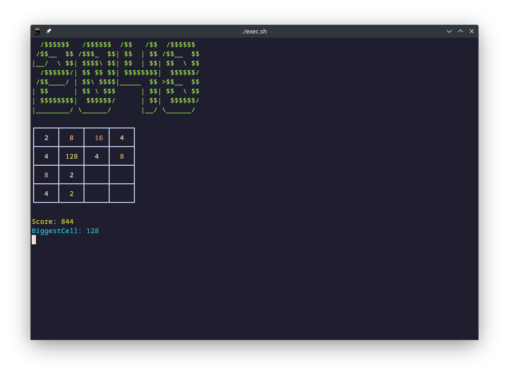
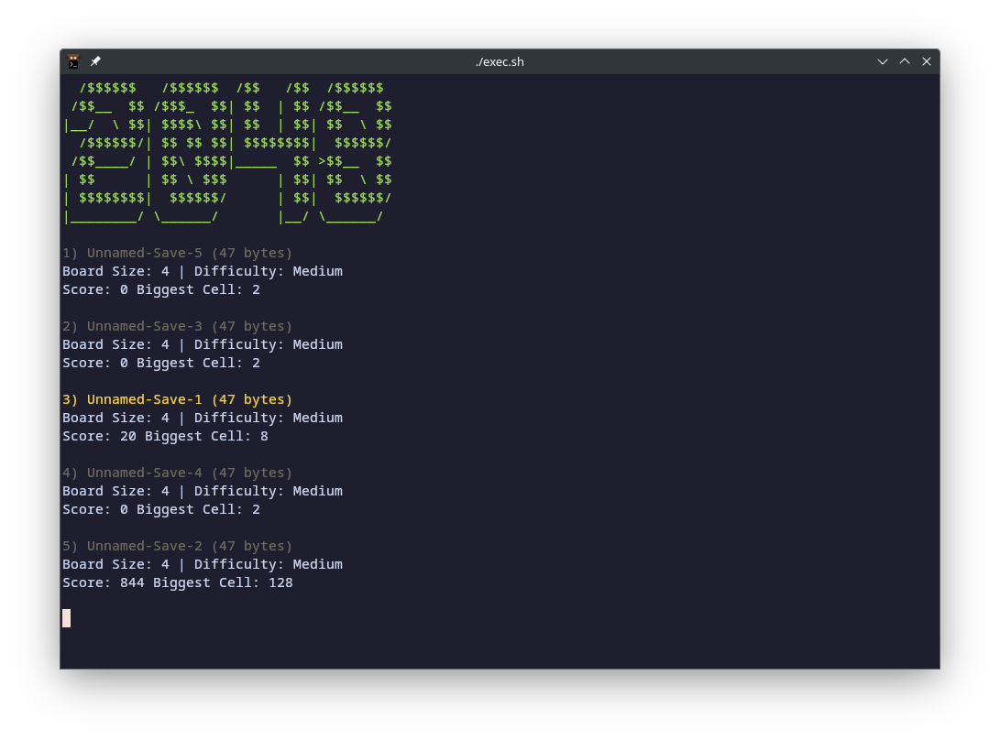

## Windows
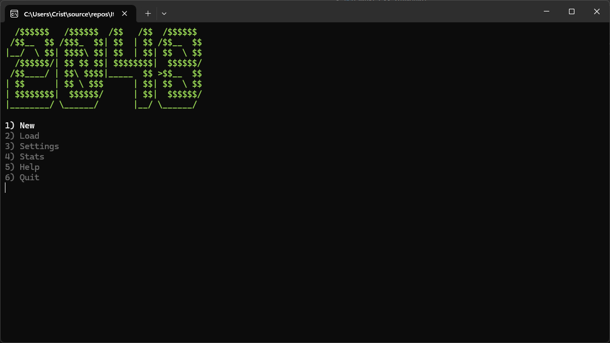
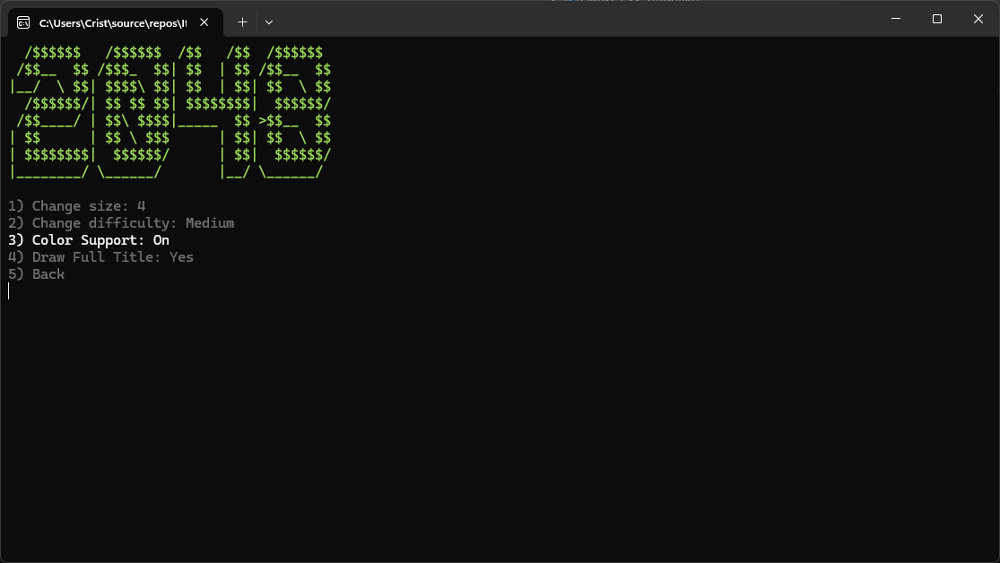
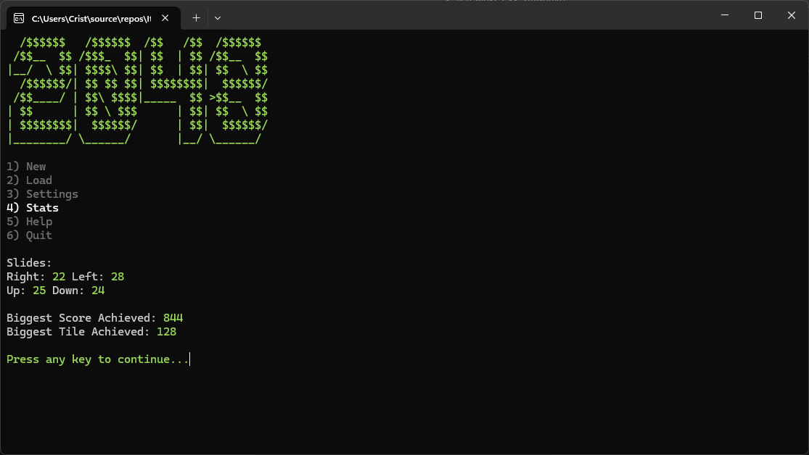
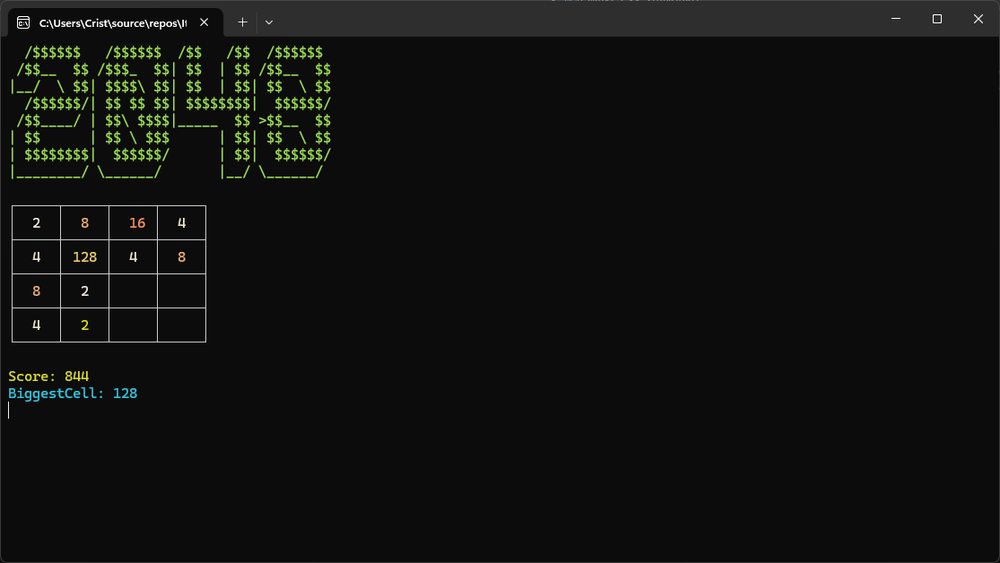
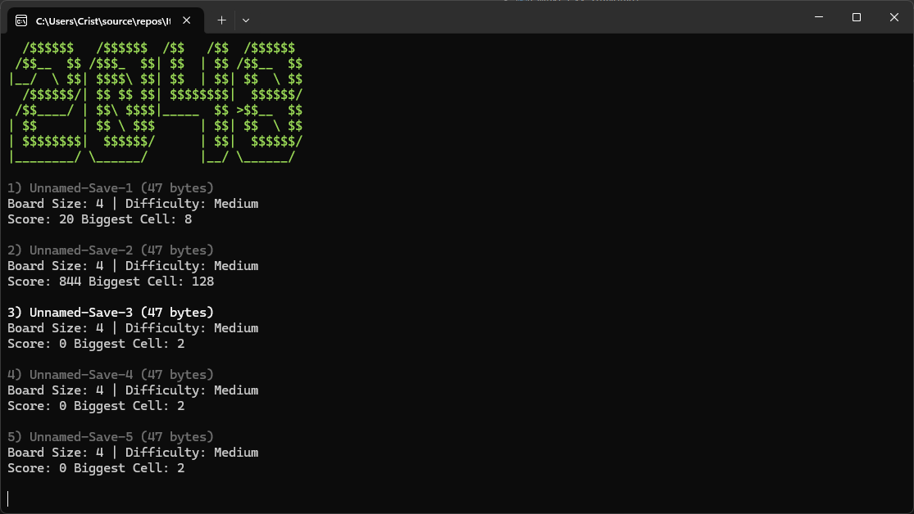

# Contact
You can contact me at cristi9270@gmail.com or cristi123612 on discord.

# License
This project is licensed under [The MIT License](https://github.com/ItsCrist1/2048/blob/main/LICENSE.txt).
