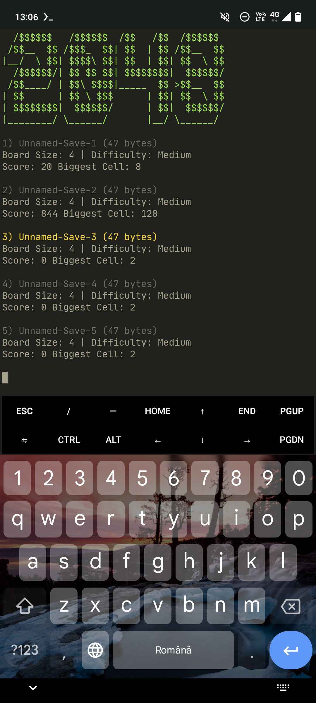

# 2048
A fast cross-platform C++ terminal implementation of the classic game [2048](https://en.m.wikipedia.org/wiki/2048_(video_game)).

# Features
- Saving and loading game states with custom settings
- Lots of settings for customization
- Custom colored cells
- Drawing tables with ASCII table symbols
- Really fast on all systems

# Compatibility
Works great with both Windows (not sure about windows 7 or older) and UNIX systems.
Linux has the best compatibility though (most of the code was written in termux).

# Building
Requirements: git (or gh) and cmake
```
git clone https://www.github.com/ItsCrist1/2048.git
mkdir 2048/bin
cd 2048/bin
cmake ..
cd ..
./exec.sh
```

# Screenshots

## Android




# Contact
You can contact me at cristi9270@gmail.com or cristi123612 on discord.

# License
This project is licensed under [The MIT License](https://github.com/ItsCrist1/2048/blob/main/LICENSE.txt).
